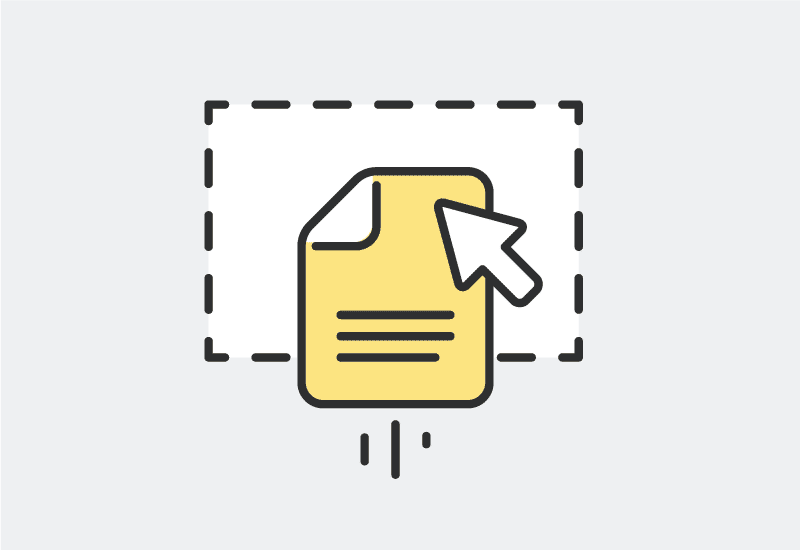
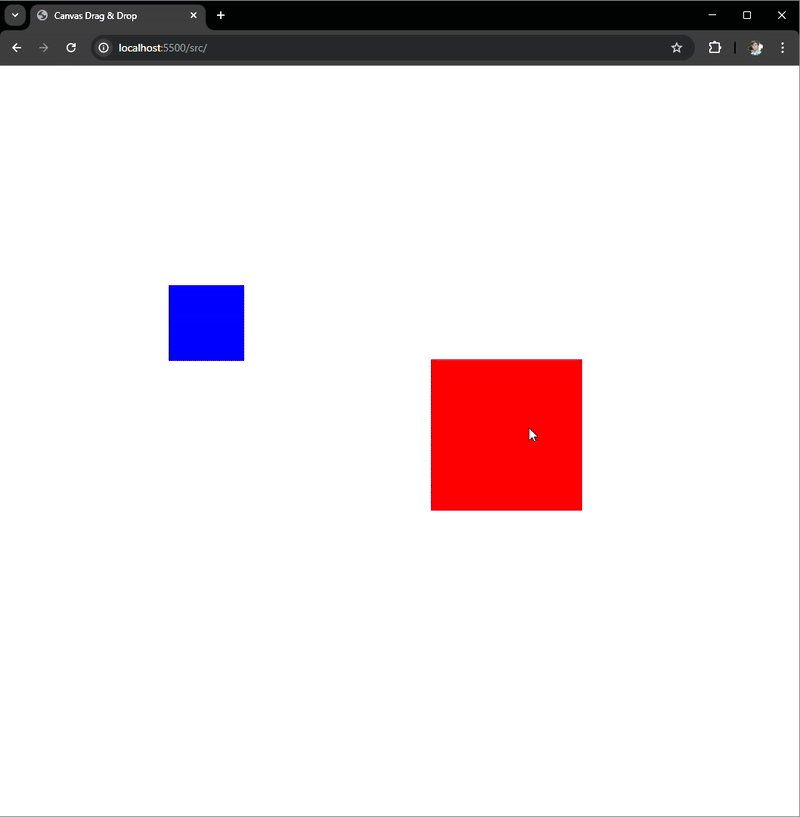

<p align="center"></p>
<p align="center">
   <br/>
  <a href="https://github.com/mateus-sartorio/canvas-drag-and-drop"><kbd>🔵 GitHub</kbd></a>
  <a href="https://github.com/mateus-sartorio/canvas-drag-and-drop"><kbd>🟢 Website</kbd></a>
</p>

# ✏️ Canvas Drag-and-drop

### Simple Drag-and-drop functionality with Canvas API

<br/>


<div align="center">
  
</div>

<br/>


## ⚙️ Running it locally

Clone the repository locally. Then, navigate to the directory of the cloned repository:

```bash
git clone https://github.com/mateus-sartorio/canvas-drag-and-drop
cd drawing-app
```

Start an HTTP server on the project root folder, and you should be able to open it up on your browser locally.

<br/>


## ⚠️ Limitations

The system does not support saving projects as of now.

<br/>


## ⚖️ License:

This program is free software: you can redistribute it and/or modify it under the terms of the GNU General Public License as published by the Free Software Foundation, either version 3 of the License, or (at your option) any later version.

This program is distributed in the hope that it will be useful, but WITHOUT ANY WARRANTY; without even the implied warranty of MERCHANTABILITY or FITNESS FOR A PARTICULAR PURPOSE.  See the GNU General Public License for more details.

You should have received a copy of the GNU General Public License along with this program.  If not, see [https://www.gnu.org/licenses](https://www.gnu.org/licenses).

This program is released under license GNU GPL v3+ license.

<br/>


## 🔧 Support:

Kindly report any issues with the application on its official repo on [github.com/mateus-sartorio/canvas-drag-and-drop](https://github.com/mateus-sartorio/canvas-drag-and-drop).

<br/>


## 📋 Disclaimer:

This project was based of off [BananaCoding's tutorial on YouTube](https://www.youtube.com/watch?v=7PYvx8u_9Sk&list=PLN0tvDAN1yvSNbkHAwPzJ5O4pP_e2vyme&index=11).